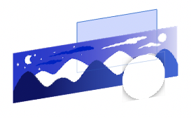

### 前言

前段时间在做自己 App 适配 Dark Mode 的时候看到了一个[Procreate的动画教程](https://www.bilibili.com/video/av82589461)以及该视频简介中的灵感来源，觉得还挺有意思的，想着~~复杂的东西我做不出来做个这个总可以吧嘿嘿嘿~~，于是准备仿照风格着手实现一下。下图我实现的效果，左边是白天，右边是黑夜。

<!--more-->


### 调研

我先看了一下原生的UISwitch的功能，大致是这样的：

```swift
var isOn: Bool
// A Boolean value that determines the off/on state of the switch.

func setOn(Bool, animated: Bool)
// Set the state of the switch to On or Off, optionally animating the transition.

var onTintColor: UIColor?
// The color used to tint the appearance of the switch when it is turned on.

var thumbTintColor: UIColor?
// The color used to tint the appearance of the thumb.
```

后两个属性对应的是 UISwitch 在 On 状态下的背景颜色和 UISwitch 中间的圆形机关颜色，那在我的这个控件里没有这个需求，所以我就不开放这两个属性了。

`setOn(Bool, animated: Bool)` 这个方法可以更改当前 UISwitch 的开关状态，并且可以输入 `animated` 参数来决定做不做动画。获取 `isOn` 这个属性可以获得是 UISwitch 当前的开关状态，更改这个属性会执行一次类似没有动画的 `setOn(Bool, animated: Bool)` 方法。

### 开始莽

开始写代码的时候，我~~不假思索的~~选择了 UIView 和 UIImageView 来作为实现方式。我的想法是通过放置一张大约两倍标准 UISwitch 宽度的长图，和通过设置 `clipsToBounds = true` 来完成图片的部分滑动。

原生 UISwitch 的尺寸是 `(width: 51, height: 31)`, 并且虽然 UISwitch 可以通过 `init(frame: CGRect) ` 来初始化但宽度和高度的设置是无效的。




莽的过程是比较简单的，首先是最底下 UIView 的初始化方法和设置圆角和切割：

```swift
class DNSwitch: UIView {
    init(withSystemSizeOn position: CGPoint, image: UIImage) {
        super.init(frame: CGRect(x: position.x - DNSwitch.width / 2,
                                 y: position.y - DNSwitch.height / 2,
                                 width: DNSwitch.width, height: DNSwitch.height))
        
        clipsToBounds = true
        layer.cornerRadius = frame.height / 2
    }
}
```

```Swift
extension DNSwitch {
    static let width: CGFloat = 51
    static let height: CGFloat = 31
    
    static let offset: CGFloat = 2
}
```

接下来是通过传入的 UIImage 来创建合适的 UIImageView，因为怕传进来的图片比开关本身还要小，所以做了个判断。另外我这里是在初始化时就传入了图片，所以这个函数就只触发一次。如果把 image 做成开关的一个属性，在初始化之后可以自己选择时机传入图片的话，也可以把这个方法改写成一个 `updateImage(image: UIImage)` 的更新 image 的方法，就是要注意在 update 的时候当前开关的状态是 On 还是 Off。

```swift
private func configureImageView(image: UIImage) {
    let ratio = image.size.height / frame.height
    let imgWidth = image.size.width / ratio
    imageView.frame.size = CGSize(width: imgWidth > frame.width ? imgWidth : frame.width, height: frame.height)
    imageView.frame.origin = CGPoint(x: imgWidth > frame.width ? frame.width - imgWidth : 0, y: 0)
    imageView.image = image
    addSubview(imageView)
}
```
配置圆形机关的属性和设置点击手势。这里的 `DNSwitch.offset` 是指圆形机关和开关之间间隙的距离。

```swift
private func configureThumbView() {
    thumbView.frame = CGRect(x: DNSwitch.offset, y: DNSwitch.offset,
                             width: frame.height - DNSwitch.offset * 2,
                             height: frame.height - DNSwitch.offset * 2)
    thumbView.backgroundColor = .white
    thumbView.layer.cornerRadius = thumbView.frame.height / 2
    
    thumbView.layer.shadowOffset = CGSize(width: 0, height: 1)
    thumbView.layer.shadowColor = UIColor.black.cgColor
    thumbView.layer.shadowRadius = DNSwitch.offset
    thumbView.layer.shadowOpacity = 0.5
    addSubview(thumbView)
}

private func prepareGestureRecognizer() {
    tapGestureRecognizer.addTarget(self, action: #selector(tap(gesture:)))
    addGestureRecognizer(tapGestureRecognizer)
}

@objc private func tap(gesture: UITapGestureRecognizer) {
    if gesture.state == .ended {
        setOn(!isOn, animated: true)
    }
}
```

接下来是关于 `setOn(Bool, animated: Bool)` 的方法，我在类中放了一个 `hasAnimate` 来存放是否执行动画。

```swift
private var hasAnimate: Bool = false

func setOn(_ isOn:Bool, animated: Bool) {
    hasAnimate = animated
    if self.isOn != isOn {
        self.isOn = isOn
    }
}
```

在每次 `isOn` 更改时，会根据当前的 `hasAnimate` 和 `isOn` 来进行动画的发生。

```swift
var isOn: Bool = false { didSet { animate() } }

private func animate() {
    if hasAnimate {
        UIView.animate(withDuration: 0.15, animations: {
            self.updateFrame()
        }) { (finish) in
            self.hasAnimate = false
        }
    } else {
        updateFrame()
    }
}

private func updateFrame() {
    if isOn {
        imageView.frame.origin = CGPoint(x: 0, y: 0)
        thumbView.frame.origin = CGPoint(x: frame.width - thumbView.frame.width - DNSwitch.offset, y: DNSwitch.offset)
    } else {
        imageView.frame.origin = CGPoint(x: frame.width - imageView.frame.width, y: 0)
        thumbView.frame.origin = CGPoint(x: DNSwitch.offset, y: DNSwitch.offset)
    }
}
```

然后找个地方把这个开关添加到屏幕上就可以了，这里的 `"switchImg"` 就是我上文的那张长图。

```swift
let position = CGPoint(x: view.center.x, y: view.center.y)
let dnSwitch = DNSwitch(withSystemSizeOn: position, image: UIImage(named: "switchImg"))
view.addSubview(dnSwitch)
```


### 莽完之后

看到这里你可能有一肚子疑惑，比如：

* 问：你这个开关为什么不用 `UIControl` 来实现，而是用 `UIView` + `UITapGestureRecognizer` 来实现？
    * ~~盲生，你发现了华点~~，是我的锅，我写到这才意识到事情的不对劲，~~但是不想再弄了~~。
    * `UIControl` 有 `addTarget(Any?, action: Selector, for: UIControl.Event)` 以及 ` sendAction(Selector, to: Any?, for: UIEvent?)` 方法也能很好的处理这类情况。
* 问：为什么你是用一张长图，而不是两张各自风格的图？
    * 是这样，我本以为两张各自风格的图会显得很突兀，但实际上由于圆形白色机关的存在会挡住一大部分图，所以使用两张各自风格的图效果应该也不错，并且可控制的范围也会更大一些。
* 问：原生的能加阴影，你设置了 `clipsToBounds = true` ，那你要加阴影不就麻烦了？
    * 对的，所以我没加阴影。
* 问：你为什么叫他白色机关？
    * 叫按钮不合适，我不知道该叫他什么。
* 问：你这白天看起来也像黑夜啊？
    * 我觉得像白天啊？不像么？


### 总结一下

* 前期的调研非常不到位。
* 再做这种触碰式的控件不用 `UIControl` 我就是🐶。
* 漏洞百出。

其实做这个 Demo 只花了 1 小时，写这篇笔记花了大半天，主要的目的还是希望自己能够养成记录的习惯，所以才没有把这篇文砍了😁。